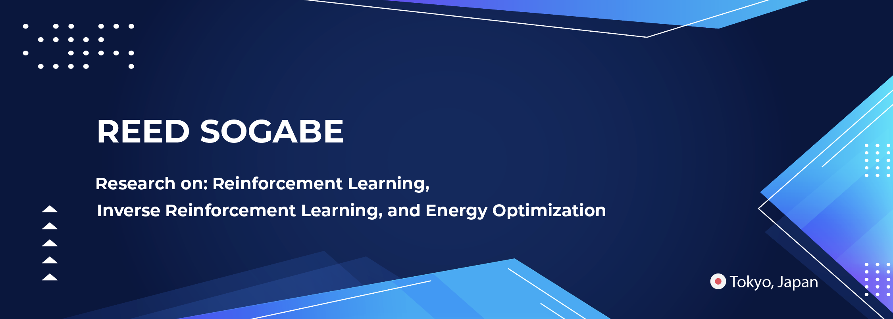

## Previous Works
►SDEWES 2022, 17th Conference on Sustainable Development of Energy, Water and Environment Systems
>Optimization of Energy Systems through Multiagent Reinforcement Learning with Risk Mitigation

>[Full PDF of SDEWES Conference Paper Accessible at Research Gate](https://www.researchgate.net/publication/365316134_Optimization_of_Energy_Systems_through_Multiagent_Reinforcement_Learning_with_Risk_Mitigation)   

►Springer Nature: Advances in Artificial Intelligence 2021
>[Impact of Domain Knowledge Quality on Inverse Reinforcement Learning](https://link.springer.com/chapter/10.1007/978-3-030-73113-7_9)   

>[Full PDF of Springer Publication Accessible at Research Gate](https://www.researchgate.net/publication/353414509_Impact_of_Domain_Knowledge_Quality_on_Inverse_Reinforcement_Learning)

► JSAI 2020 (34th Annual Conference of the Japanese Society for Artificial Intelligence) 
>[Bootstrapping Baysian Inverse Reinforcement Learning in Robotics through VR Demonstrations](https://www.jstage.jst.go.jp/article/pjsai/JSAI2020/0/JSAI2020_2G1ES402/_article/-char/en)

>[JSAI Conference Materials & Information](https://confit.atlas.jp/guide/event/jsai2020/subject/2G1-ES-4-02/detail?lang=en) 

>[Full PDF of JSAI Publication accessible at Research Gate](https://www.researchgate.net/publication/353609919_Bootstrapping_Baysian_Inverse_Reinforcement_Learning_in_Robotics_through_VR_Demonstration)

### [🔗 Link to Research Gate ](https://www.researchgate.net/profile/Reed-Sogabe)
